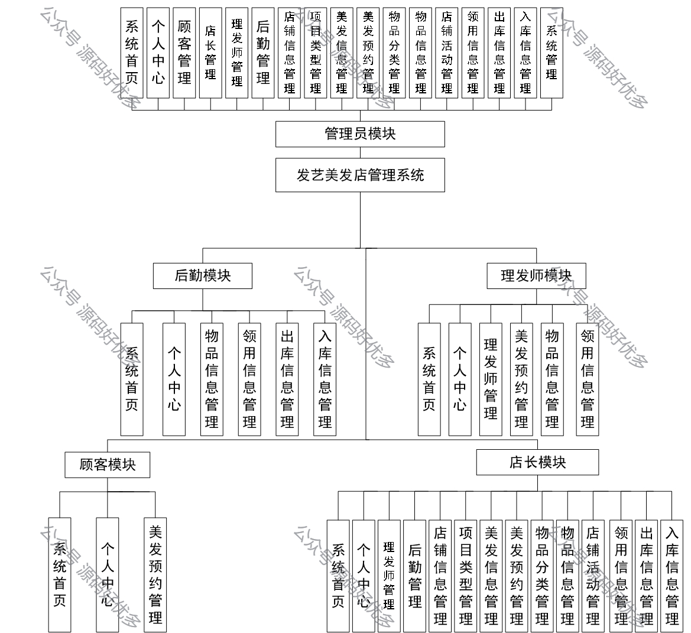
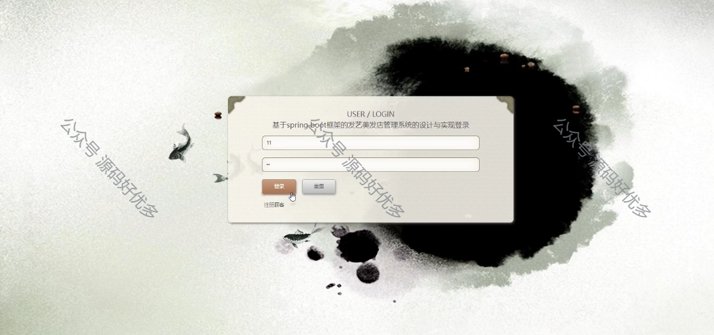
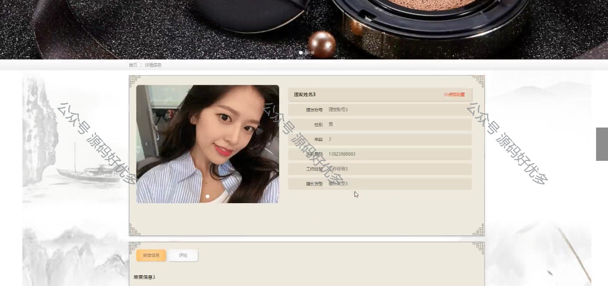
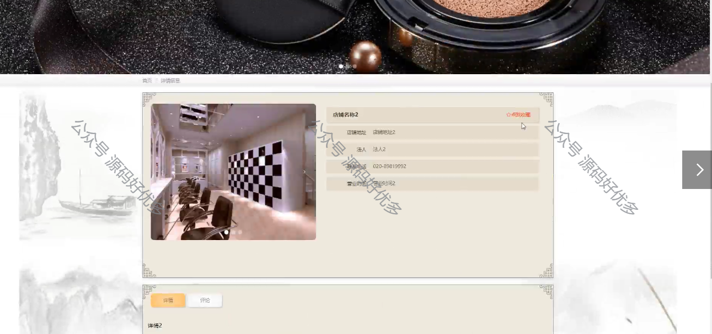
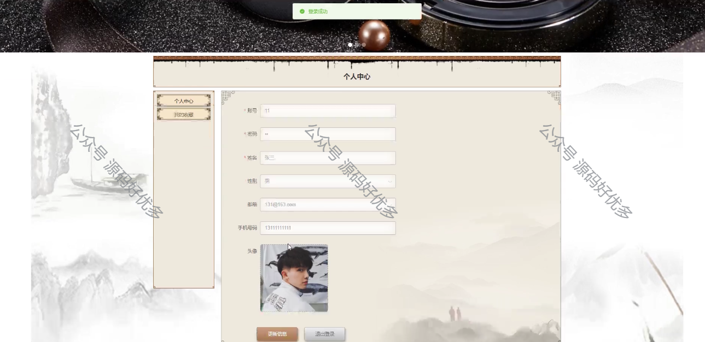
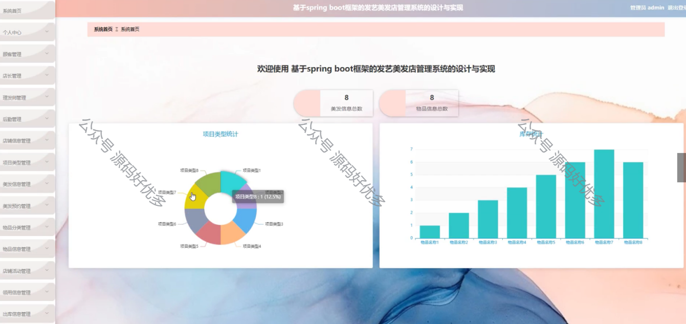
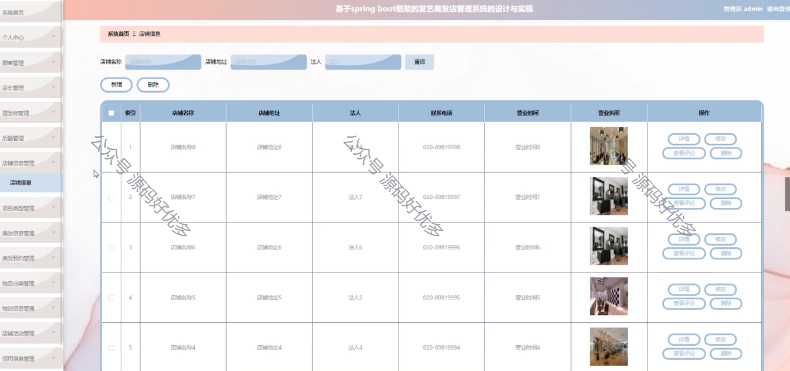
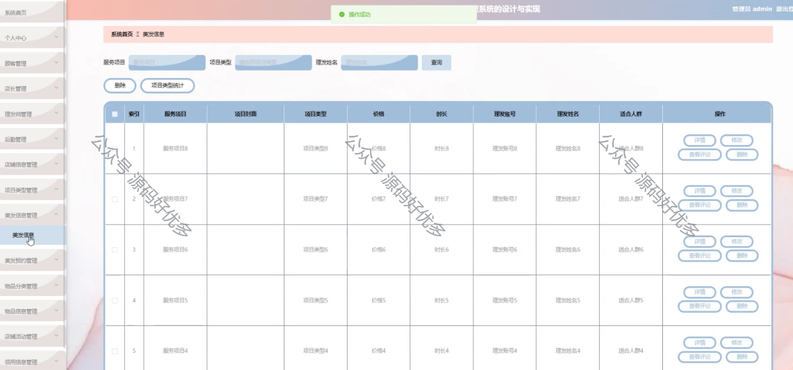
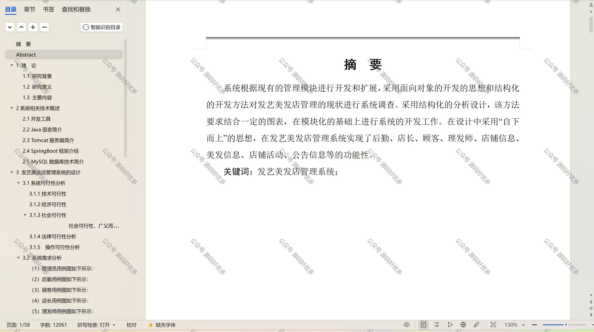

 
## 查看主页获取源码

> **作者介绍**： **✌**全网粉丝10W+本平台特邀作者、博客专家、CSDN新星计划导师、java领域优质创作者,博客之星、掘金/华为云/阿里云/InfoQ等平台优质作者、专注于项目实战 **✌**

  

### 一、作品包含

源码+数据库+设计文档万字+PPT+全套环境和工具资源+部署教程

### 二、项目技术

前端技术：Html、Css、Js、Vue、Element-ui

数据库：MySQL

后端技术：Java、Spring Boot、MyBatis

  

### 三、运行环境

开发工具：IDEA/eclipse

数据库：MySQL5.7

数据库管理工具：Navicat10以上版本

环境配置软件： JDK1.8+Maven3.6.3

前端Nodejs：14

### 四、项目介绍
项目编号：springbootA114

发艺美发店管理系统是在美发行业服务需求日益多样化和个性化，以及信息技术的快速发展背景下，应运而生的一套专门针对美发店的信息化管理工具，旨在帮助美发店提高运营效率，优化客户体验，提升员工的工作效率，并实现美发店管理的现代化和智能化。

系统分为管理员、后勤、理发师、顾客、店长。
管理员的功能：系统首页、个人中心、顾客管理、店长管理、理发师管理、后勤管理、店铺信息管理、项目类型管理、美发预约管理、美发信息管理、物品分类管理、物品信息管理、店铺活动管理、领用信息管理、出库信息管理、入库信息管理、系统管理。
后勤的功能：系统首页、个人中心、物品信息管理、领用信息管理、出库信息管理和入库信息管理。
理发师的功能：系统首页、个人中心、理发师管理、美发预约管理、物品信息管理和领用信息管理。
顾客的功能：系统首页、个人中心、美发预约管理。
店长的功能：系统首页、个人中心、理发师管理、后勤管理、店铺信息管理、项目类型管理、美发类型管理、美发预约管理、物品分类管理、物品信息管理、店铺活动管理、领用信息管理、出库信息管理、入库信息管理。
### 五、运行截图

  
